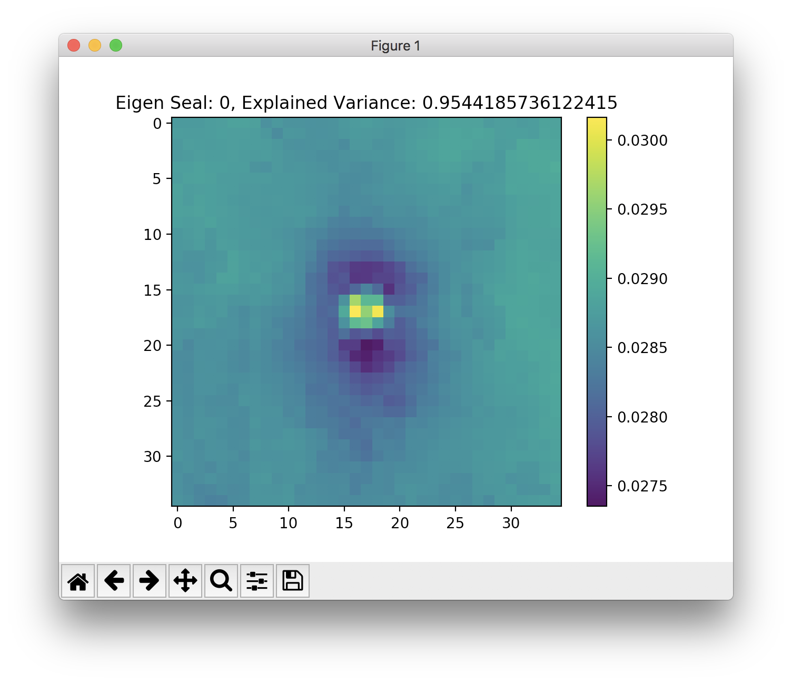

## Hotspot Classifier based on Random Forest Classifier

This folder contains the code for training and applying a random forest classifier in sci-kit learn to the arcticseal data. The classifier uses Sci-Kit Learn's classifier class so they can easily be switched out to test other classifiers. We are also using PCA to project the raw data onto "eigen-seals" like the following table:
|Eigen Seal 1 | Eigen Seal 2|
|------------ | ------------|
| | |

## Classifying
The classification script supports two modes for processing images: command line and as a library import to another script.

#### Launch Classifier from the Command line
The script requires three flags from the command line with an optional fourth:
1. `--datadir` the path to the directory where the thermal images are stored
1. `--datafile` the path to the csv file that you want to process
1. `--modelfile` the path to the pickled version of the classifier (output by hotspot_training.py)
1. `--outfile` (optional) the path where the csv with classification information should be written. Defaults to `./output.csv`

The classified CSV file will have the column `hotspot_type` filled in with either "Anamoly" or "Animal" depending on the classification. It will also fill in the column `ir_confidence` that contains the confidence that the classifier has in its decision.

An example of running the script is shown below:
```bash
python hotspot_classifier.py --datadir ./ArcticSealsData01_Thermal_N/ --datafile ../arcticseals/data/test.csv --modelfile pca_rfc_model_20180725_154906.p
```

#### Use Classifier as a Import
The main function for classifying is called `classify_data` and takes the same input values that are passed from the command line as arguments. The function definition and doc string are shown here for convenience:
```python
def classify_data(data_file, data_directory, model_file, output_file):
    """Data loading, classifying and output logic. For compatibility with library inputs
    Inputs:
        data_file: string, path to the input csv file
        data_directory: string, path to the thermal images
        model_file: string, path to the classifier model
        output_file: string, path to the output csv file
    """
```

## File Description
* hotspot_classifier.py: Function for applying the model to a new set of data
* hotspot_training.py: Script for training the model
* pca_rfc_model_20180725_154906.p: Pre-trained model on arcticseals/data/train.csv
* requirements.txt: pip compatible file listing the required dependencies. Install using `pip install requirements.txt`
* README.md: this file
